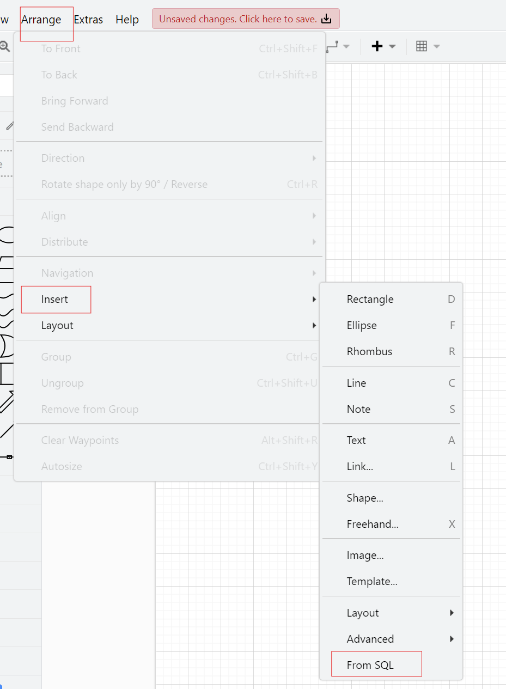
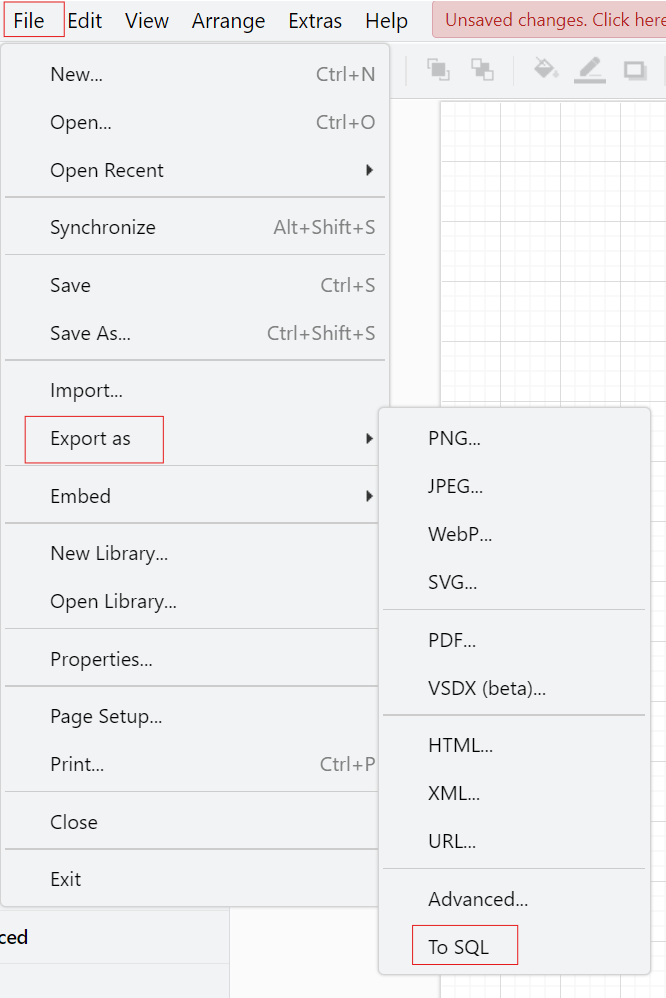

# sqltooling-drawio
plugins for sql tooling in drawio

## Getting Started
* see https://github.com/ariel-bentu/tam-drawio for multiple install options
* download plugin file
    * [sql.js](https://raw.githubusercontent.com/lastlink/sqltooling-drawio/main/dist/sql.js)
    * or clone project `git clone --branch main git@github.com:lastlink/sqltooling-drawio.git` and check `dist folder`
* vscode [Draw.io Integration](https://marketplace.visualstudio.com/items?itemName=hediet.vscode-drawio)
    * settings.json
    ```json
    "hediet.vscode-drawio.plugins": [
    {
      "file": "xxx\\sqltooling-drawio\\dist\\sql.js"
    },
    ```

## Examples
* 
* 

## Development
* `npm install`
* `npm build:client` to update `dist/sql.js`