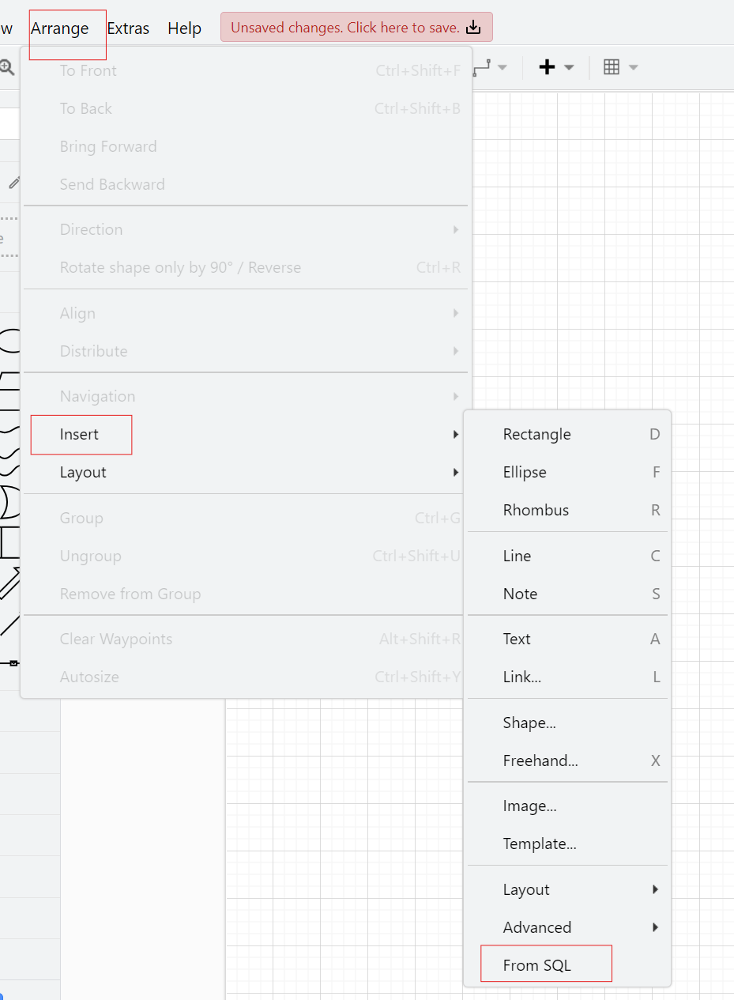
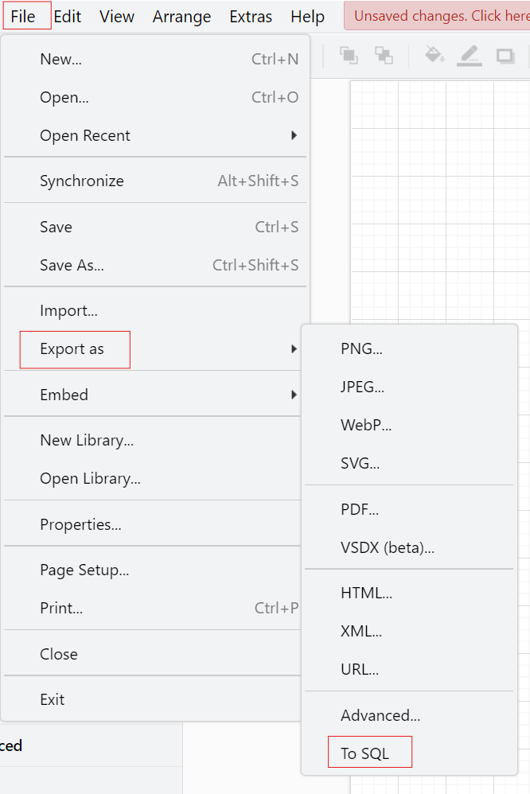
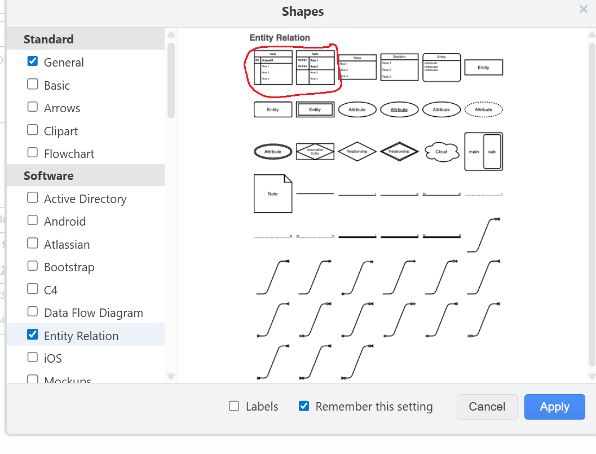

# SQL Tooling for Draw.io

Third-party plugins that add SQL and NoSQL tooling to Draw.io. Contributions welcome!

## Table of Contents

- [Overview](#overview)
- [Download](#download)
  - [Option 1: Direct Download](#option-1-direct-download)
  - [Option 2: Clone Repository](#option-2-clone-repository)
- [Installation](#installation)
  - [VSCode Integration](#vscode-integration)
  - [Desktop App Integration](#desktop-app-integration)
- [Features](#features)
  - [SQL Plugin (`sql.js`)](#sql-plugin-sqljs)
  - [NoSQL Plugin (`nosql.js`)](#nosql-plugin-nosqljs)
  - [TypeScript Plugin (`nosql-ts.js`)](#typescript-plugin-nosql-tsjs)
- [Examples](#examples)
- [Development](#development)
  - [Prerequisites](#prerequisites)
  - [Setup](#setup)
  - [Build Commands](#build-commands)
- [Contributing](#contributing)
- [License](#license)

---

## Overview

This project provides Draw.io plugins for working with SQL and NoSQL artifacts:

- Import and export SQL DDLs
- Import and export OpenAPI (OpenAPI 3) JSON
- Generate TypeScript interfaces
- Visualize and edit database schemas in Draw.io

## Download

### Option 1: Direct Download

Get the built plugin files from the releases page or use the raw links:

- [Releases](https://github.com/funktechno/sqltooling-drawio/releases)
- `dist/sql.js` — SQL import/export: https://raw.githubusercontent.com/funktechno/sqltooling-drawio/main/dist/sql.js
- `dist/nosql.js` — OpenAPI import/export: https://raw.githubusercontent.com/funktechno/sqltooling-drawio/main/dist/nosql.js
- `dist/nosql-ts.js` — TypeScript & OpenAPI: https://raw.githubusercontent.com/funktechno/sqltooling-drawio/main/dist/nosql-ts.js
  - ⚠️ **Note**: Not VSCode compatible

> Note: Minified variants (e.g., `nosql.min.js`) are available for production use.

### Option 2: Clone Repository

Clone the repo and use the files from `dist/`:

```bash
git clone --branch main https://github.com/funktechno/sqltooling-drawio.git
cd sqltooling-drawio
```


## Installation

### VSCode Integration

If you use the Draw.io extension for VSCode (hediet.vscode-drawio), add the plugin files to your settings:
* windows
```json
{
  "hediet.vscode-drawio.plugins": [
    {
      "file": "path\\to\\sqltooling-drawio\\dist\\sql.js"
    },
    {
      "file": "path\\to\\sqltooling-drawio\\dist\\nosql.js"
    }
  ]
}
```
* mac
```json
{
  "hediet.vscode-drawio.plugins": [
    { "file": "path/to/sqltooling-drawio/dist/sql.js" },
    { "file": "path/to/sqltooling-drawio/dist/nosql.js" }
  ]
}
```

### Desktop App Integration

To run the plugin in the Draw.io Desktop app:

-
1. **Clone or Download Draw.io Desktop**
   - **Option A (Git Clone)**: `git clone --recursive https://github.com/jgraph/drawio-desktop.git` (1 GB clone)
   - **Option B (Download ZIP)**: Download from [dev.zip](https://github.com/jgraph/drawio-desktop/archive/refs/heads/dev.zip) and unzip
   - ⚠️ **Note**: Don't download precompiled from Releases as you can't modify the plugins
2. Install dependencies: `npm install` in the `drawio-desktop` directory.
3. Replace `drawio/src/main/webapp/plugins/sql.js` with the built `dist/sql.js` from this repo.
4. Start the app: `npm start`.
5. Add the plugin via Extras → Plugins → Add, then restart Draw.io.

## Features

### SQL Plugin (`sql.js`)
- Import SQL DDL into Draw.io diagrams
- Export diagrams to SQL DDL
- Visualize database schema relationships

### NoSQL Plugin (`nosql.js`)
- Import and export OpenAPI (OpenAPI 3) JSON
- Generate language bindings using OpenAPI
- Visualize API models and relationships

### TypeScript Plugin (`nosql-ts.js`)
- Import/export TypeScript interfaces
- Interoperate with OpenAPI generation

## Examples

### SQL Import/Export



### Export Options



### Usage

Shapes: More Shapes → Entity Relation



## Development

### Prerequisites
- Node.js 22
- npm

### Setup

```bash
npm install
```

### Build Commands

- `npm run build:client:sql` — build `dist/sql.js`
- `npm run build:client:nosql` — build `dist/nosql.js`
- `npm run build:client:all` — build all files under `dist/`

## Contributing

Contributions are welcome. Please open issues or submit PRs following standard contribution guidelines.

## License

See the -[LICENSE](LICENSE) file for license details.